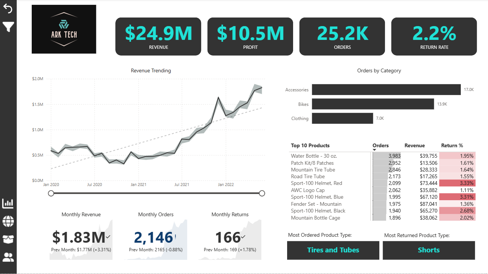
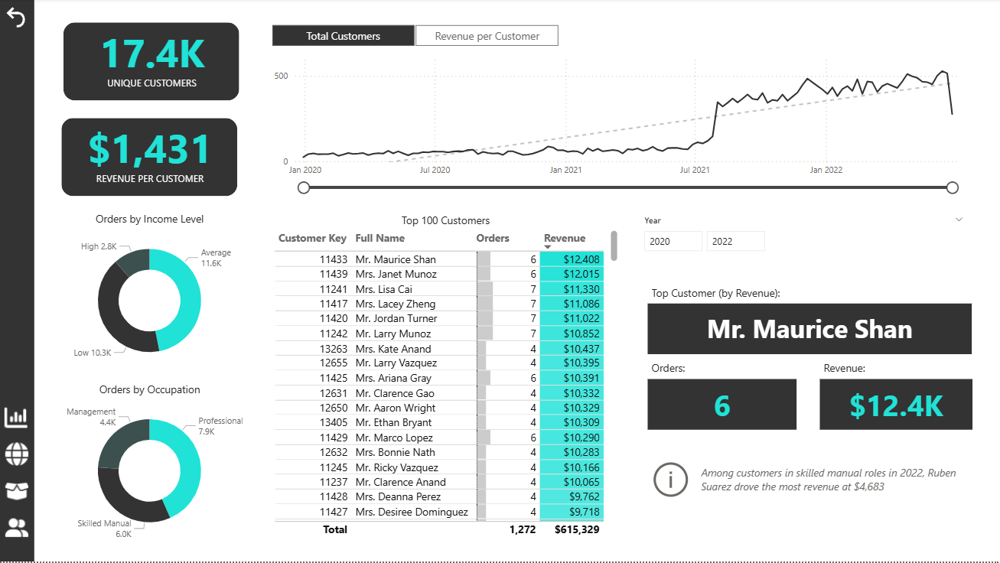
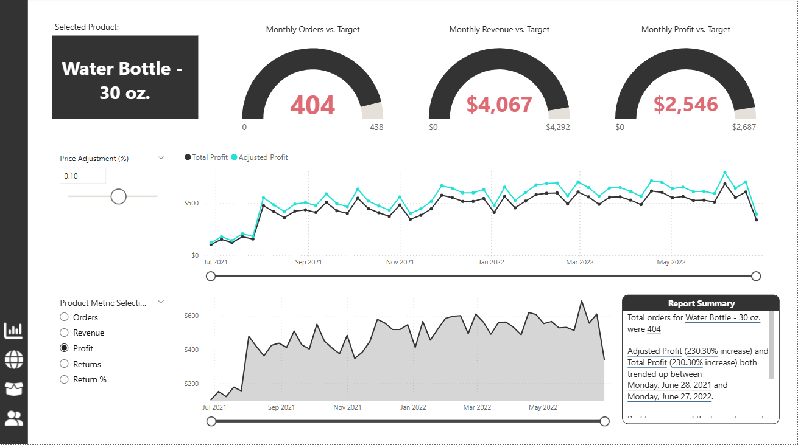
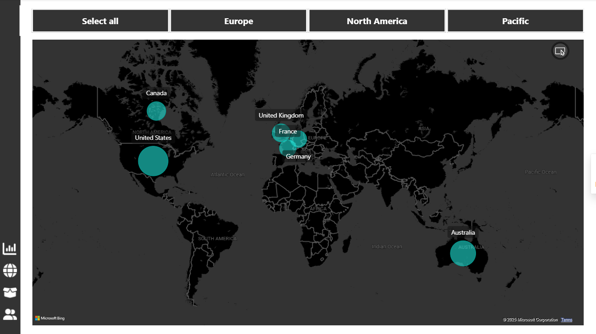

# AdventureWorks Retail Dashboard

## Project Overview
This project demonstrates a **Power BI dashboard** built using the AdventureWorks dataset.  
It showcases reporting, DAX, and interactive visualizations.

Key insights covered:
- Revenue trends by product, category, and region
- Customer segmentation dashboards
- Executive summary view
- Map-based visualization of sales

---

## Repository Structure
- **/pbip/** → Power BI Project files (open `.pbip` in Power BI Desktop)
- **/Demo/** → Screenshots of the dashboard
- **README.md** → Project documentation

---

##  How to Open
1. Clone/download this repository.  
2. Open `pbip/AdventureWorks Retail Report.pbip` in PBI Desktop.  
3. If prompted, connect to the dataset (AdventureWorksDW2014).  
4. Refresh to explore interactively.  

---

## Demo
  
  
  
  

---

## Notes 
- The original PBIX file can also be provided if needed, please let me know  
- Dataset is sample training data from Microsoft’s AdventureWorks warehouse 
